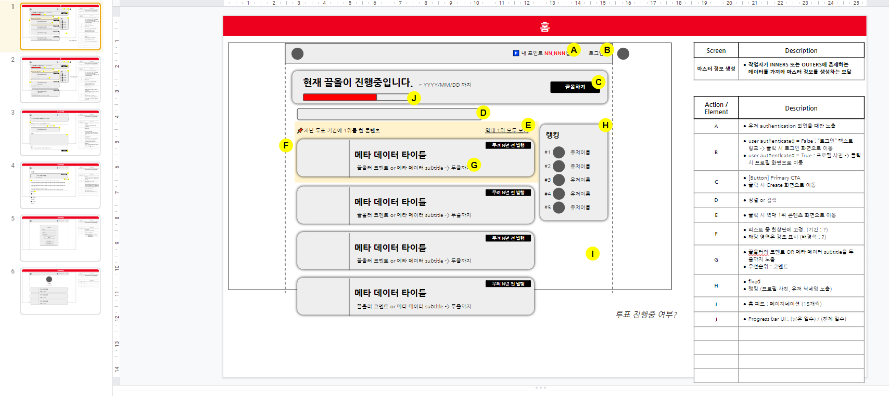

# 끌올(Krawl)

> 세상에는 새로운 콘텐츠가 (말 그대로) 넘쳐납니다. 
> 우리는 그로 인해 외면받는 부분을 조명하고자 합니다. 발행된지는 오래되었지만, 그냥 묻히기에는 아까운 콘텐츠들 말입니다. 마치 고전 작품처럼요.

  

5년 이상 묵힌 콘텐츠만 취급합니다. 
끌올은 따끈따끈한 정보를 좇지 않습니다. 곰팡내도 좀 나고 먼지도 쌓인, 
하지만 여전히 번뜩이는 통찰력을 가진 콘텐츠만을 취급합니다.

## 프로젝트 소개

- 홈페이지: https://www.krawl.xyz/
- 프로젝트 PCD문서: https://www.notion.so/Product-Context-Document-22a50642b0bd45458d4d1af576b1925d
- 백엔드: https://github.com/RyanYJOh/krawl_back
- 블로그: https://brunch.co.kr/@yyjo1104/119

## 프로젝트 진행

- 첫 테이블 구성도
  

- 화면 기획서
  

## 업데이트 내역

- 2022-03-21
  - 1.0 1차 기능 및 디자인 완성.

## 정보

- 4국회 Inc.
- 문의는 taeung2008@gmail 로 메일 보내주시기 바랍니다.
